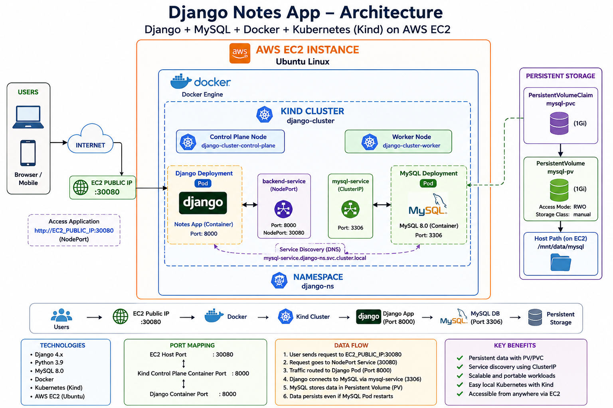
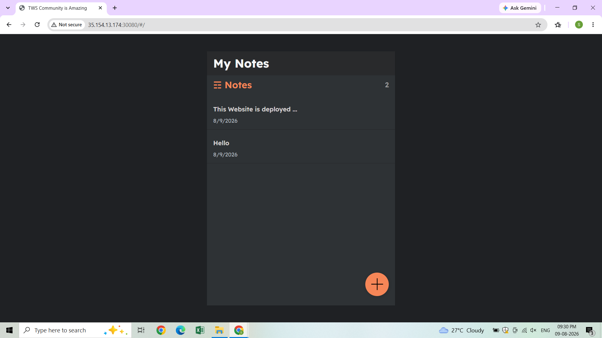
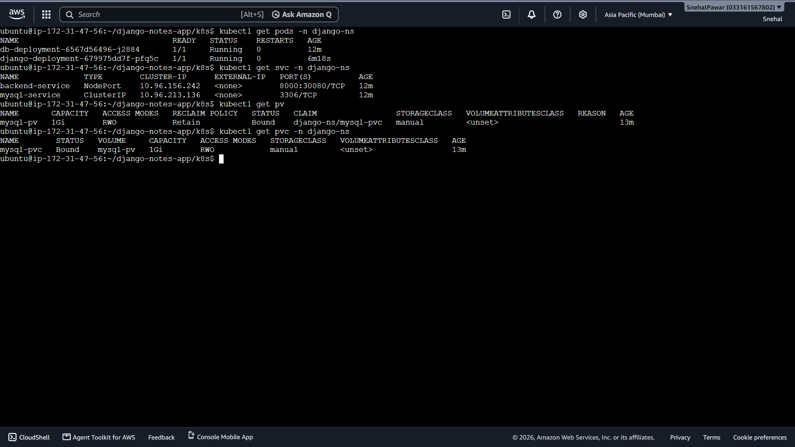
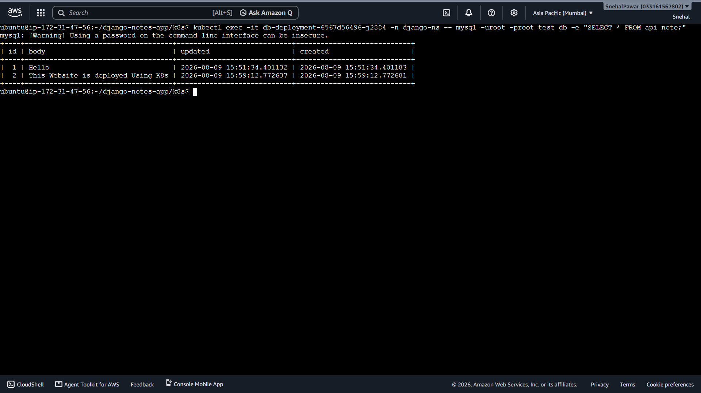

# 📝 Django Notes App (Mini Project) — Docker + Kubernetes (Kind) on AWS EC2

[](https://www.djangoproject.com/)
[](https://www.python.org/)
[](https://www.mysql.com/)
[](https://www.docker.com/)
[](https://kind.sigs.k8s.io/)
[](https://aws.amazon.com/ec2/)

> A containerized Django Notes application deployed on a local **Kind Kubernetes cluster running inside Docker on an AWS EC2 Ubuntu instance**, with MySQL persistence using Kubernetes PV/PVC.

---

## 🏗️ Architecture



### Request flow

```text
User
  ↓
AWS EC2 Public IP :30080
  ↓
Kind / NodePort 30080
  ↓
Django Pod :8000
  ↓
mysql-service :3306
  ↓
MySQL Pod
  ↓
PV → PVC → /mnt/data/mysql
```

**Detailed deployment and troubleshooting instructions:**  
➡️ See [`INSTRUCTIONS.md`](INSTRUCTIONS.md)

---

## 🧰 Tech Stack

| Layer | Technology |
|---|---|
| Application | Django + Python |
| Frontend | React |
| Database | MySQL 8.0 |
| Containerization | Docker |
| Orchestration | Kubernetes / Kind |
| Infrastructure | AWS EC2 Ubuntu |
| Storage | Kubernetes PV + PVC |
| Networking | ClusterIP + NodePort |

---

## 📁 Kubernetes Configuration

```text
k8s/
├── cluster.yml
├── namespace.yml
├── deployment.yml
├── service.yml
├── db_deployment.yml
├── db-svc.yml
├── db-pv.yml
└── db-pvc.yml
```

### What each file does

- `cluster.yml` — creates the Kind cluster and EC2 port mapping.
- `namespace.yml` — creates `django-ns`.
- `deployment.yml` — deploys the Django Notes application.
- `service.yml` — exposes Django through NodePort `30080`.
- `db_deployment.yml` — deploys MySQL 8.0.
- `db-svc.yml` — exposes MySQL internally on port `3306`.
- `db-pv.yml` — defines persistent storage.
- `db-pvc.yml` — claims the MySQL persistent volume.

---

## 🚀 Quick Deployment

```bash
# Clone project
git clone <YOUR_REPOSITORY_URL>
cd django-notes-app

# Enter Kubernetes configuration
cd k8s

# Create Kind cluster
kind create cluster --config cluster.yml

# Deploy namespace, storage, database and application
kubectl apply -f namespace.yml
kubectl apply -f db-pv.yml
kubectl apply -f db-pvc.yml
kubectl apply -f db_deployment.yml
kubectl apply -f db-svc.yml
kubectl apply -f deployment.yml
kubectl apply -f service.yml

# Check resources
kubectl get pods -n django-ns
kubectl get svc -n django-ns
kubectl get pv
kubectl get pvc -n django-ns
```

> For the complete deployment procedure, database setup, EC2 networking, verification and troubleshooting, use [`INSTRUCTIONS.md`](INSTRUCTIONS.md).

---

## 🌐 Access

The application is designed for the EC2 public endpoint:

```text
http://EC2_PUBLIC_IP:30080
```

For this Kind setup, `cluster.yml` maps the EC2 host port `30080` to the Kind control-plane container port `8000`.

Make sure the AWS EC2 **Security Group** allows inbound TCP traffic on `30080` if the application must be reachable from the internet.

---

## 💾 Persistent MySQL Storage

```text
MySQL Pod
   │
   ▼
mysql-pvc
   │
   ▼
mysql-pv
   │
   ▼
EC2 hostPath
/mnt/data/mysql
```

The MySQL container mounts the persistent volume at:

```text
/var/lib/mysql
```

This keeps database files outside the container filesystem.

---

## 🔍 Useful Verification Commands

```bash
kubectl get all -n django-ns
kubectl get pv
kubectl get pvc -n django-ns
kubectl get endpoints mysql-service -n django-ns
kubectl logs deployment/django-deployment -n django-ns
kubectl logs deployment/db-deployment -n django-ns
```

Check the database:

```bash
kubectl exec -it deployment/db-deployment -n django-ns -- \
mysql -uroot -proot test_db -e "SHOW TABLES;"
```

---

## 📸 Project Screenshots






---

## 📚 Documentation

The README is intentionally kept concise.

**Complete deployment guide:** [`INSTRUCTIONS.md`](INSTRUCTIONS.md)

It contains:

- Prerequisites
- Docker image workflow
- Kind cluster creation
- Kubernetes deployment
- MySQL database initialization
- PV/PVC configuration
- NodePort / EC2 networking
- Verification commands
- Logs and debugging
- Common errors and fixes
- Cleanup commands

---

## 👩‍💻 Project

**Django Notes App**  
Containerized and deployed with **Docker, Kubernetes (Kind), MySQL and AWS EC2**.
